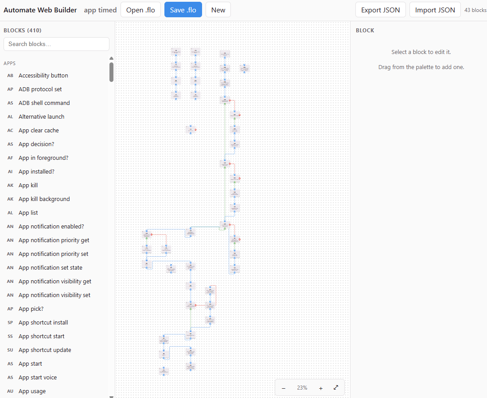

# Automate Web Builder




This project is a web page. It opens a [LlamaLab Automate](https://llamalab.com/automate/)
`.flo` file, edits it, and saves it again. Automate reads the saved file without an
error.

You can build a flow on a phone. Editing one is harder, because the blocks are small
and the expression box is narrow. This project draws the same flowchart on a desktop
screen. It also writes the flow as JSON, which you can give to an AI agent.

> This project is not official. LlamaLab did not make it. It reads and writes the
> `.flo` format. It does not run flows.

## What it does

- Opens and saves `.flo` files. The format code comes from the app's own read and
  write methods, and it follows the rules for each format version. Files from old
  Automate versions open correctly.
- Knows every block type. Each block keeps the app's own title, summary, icon and
  documentation link. You can search the blocks or read them by category.
- Draws the flowchart like the app. The grid, the block shape and the connection
  routes match. The connector colours match too (IN, OK, YES, NO, FAIL, DO, NEW).
- Edits expressions. A field shows real Automate expression source, such as
  `"Do you want to run BigOS " ++ versionbigos ++ " Setup?"`. A parser turns your
  text back into the flow. Lists, maps and operator trees stay as they are.
- Reads and writes JSON, so an AI agent can read or rewrite the flow.
- Has panels that you can resize. Drag a divider to change a width. Double-click a
  divider to reset it. The editor remembers the widths.

## The byte for byte test

Open a `.flo` file and save it with no edits. The new file must equal the old file,
byte for byte. The tests check this. This project calls that a round trip.

This says nothing about files that you edit. An edit changes bytes. It says
something about the parts that you did not edit.

The format has hundreds of optional fields. Each field belongs to a range of format
versions. If the reader gets one field wrong, a save can drop that field or damage
it. Nothing on the screen shows the fault. An exact copy shows that the editor lost
nothing.

The tests run two checks against real flows:

- Open a file, then save it with no edits. The bytes must be equal.
- Change one thing. Only that thing may differ. Every other block keeps its type,
  its position, its arguments and its connections.

Move a block and save the file, and one block gets new coordinates. The editor
writes the rest of the file back as it arrived. This includes the fields that the
editor has no screen for.

## Where the format data comes from

The format data comes from `com.llamalab.automate` 1.51.1262. A decompiler produced
the app's Java source. The `z0` and `S` methods read and write each block. A script
reads those methods and writes the format data. Nobody typed the format data by
hand.

The tests also run against a set of real community flows. These flows cover most
format versions that Automate has used. Every one is byte-identical after a round
trip, through the codec and through the editor.

Run this command to test your own flows:

```bash
FLO_FIXTURES=/path/to/your/flows npm test
```

## Getting started

You can run this project in three ways. The first way needs the least work.

### 1. One HTML file

Build `automate-web-builder.html`, or download it from a release. Then open it in a
browser. The file holds the whole editor. It needs no server, no Node and no
network. It works from a disk or a USB stick.

```bash
npm run build:single     # writes dist/automate-web-builder.html
```

Every release has this file attached, so you can download it without a clone of the
repository.

### 2. A static site

Run `npm run build`. It writes plain HTML, JavaScript and CSS into `dist/`. Put that
folder on GitHub Pages, on Netlify, or on any web server. There is no server
program.

This project publishes its own site that way. `.github/workflows/pages.yml` runs on
each push. It checks the types, runs the tests and builds both editions. A push to
the default branch then deploys to GitHub Pages. A push to any other branch, and
every pull request, stops after the checks.

`.github/workflows/ci.yml` runs the same checks and keeps the result as a workflow
artifact. Push a `v*` tag, and `.github/workflows/release.yml` publishes a GitHub
release. That release holds the single HTML file and a zip of the static site.

### 3. Development

```bash
npm install
npm run dev
```

Node is a build tool only. It compiles the TypeScript and bundles the app. The
editor itself does not need Node. It never uploads a flow. The browser reads and
writes every file.

### Block icons

The block icons come from LlamaLab's icon font. This project does not include that
font. Without it, the editor draws the first letters of each block name. The rest of
the editor behaves the same.

Use your own copy of the APK to get the real icons:

```bash
node scripts/extract-apk-assets.mjs path/to/automate.apk
npm run dev          # or npm run build:single, which embeds the font
```

The editor checks at run time whether the font loaded. The icon characters sit in a
private area of Unicode. Without the font, they draw as blank space.

## Use the editor

Drag a block from the list on the left onto the canvas. Click a block to select
it. The panel on the right shows its arguments.

To connect two blocks, do one of these:

- Press an output port (OK, YES, NO, FAIL, DO or NEW) and drag to the target
  block. Drop anywhere on that block. You do not need to hit its IN dot.
- Click an output port. It grows a ring. Then click the target block.

To remove a connection, click the output port that it leaves from. To cancel a
port that waits for a target, click that port again, or click the empty canvas.

Drag the canvas to pan it. Use the wheel to zoom. The ⤢ button fits the whole
flow on the screen.

## Edit a flow with an AI agent

Give the agent [docs/LLM-GUIDE.md](docs/LLM-GUIDE.md). With that guide, an agent can
add blocks, move connections and change expressions. The guide is complete on its
own, so the agent does not need to read the source. `tests/guide.test.ts` runs every
example in the guide. An example that stops working fails a test.

[examples/](examples/) builds whole flows from nothing with the same API.
`examples/app-usage-today.ts` writes a flow that asks an Android TV over ADB how long
an app ran today. It also shows how the `Subroutine` block makes a function that you
can reuse.

[docs/BLOCKS.md](docs/BLOCKS.md) lists every block type. You can also search from the
command line:

```bash
npm run blocks -- wifi           # find a block by what it does
npm run blocks -- --id 1046      # show its ports and arguments
```

Read an existing flow first:

```bash
npm run explain -- path/to/flow.flo          # what it does, step by step
npm run explain -- path/to/flow.flo --json   # the same, as JSON
npm run lint -- path/to/flow.flo             # what can fail on a device
```

## Faults that only show on the device

A `.flo` file can be correct and still fail on the phone. Two faults from this
project did that. A dialog with no "Show window" flag showed a notification instead
of a window, and the flow stopped. An argument that Automate checks at run time was
empty, so the block failed the moment it ran. Both files parsed, passed validation
and round-tripped byte for byte.

The editor now reports these faults while you work. It shows a count in the tool bar,
a dot on the block, and the reason under the field. `npm run lint` reports the same
from the command line.

The rules come from two separate sources. The first source is Automate's own run-time
checks, which a script reads from the decompiled app. The second source is a set of
community flows by several hundred authors. Each report carries its own evidence:

```
error   #7 App kill: packageName is required — the app throws
        RequiredArgumentNullException, and all 464 real blocks of this type set it
warning #4 Dialog choice?: startActivity is unset, but 2328 of 2333 real blocks
        of this type set it
```

The linter reports no errors on the flows in the test set. Those flows work, so any
report on them would be a false alarm.

Build your own set of flows and check this project against it:

```bash
# Largest flows first. The limit per author stops one person from changing the
# counts too much.
npx tsx tools/fetch-community.ts corpus --max 900 --min-statements 30
npm run audit -- corpus
npx tsx tools/mine-conventions.ts corpus > src/data/conventions.json
```

`npm test` and `npm run audit` do different jobs. The test suite needs flows that it
can pass. The audit takes flows from other people, and it lists the files that this
project cannot read.

When a file fails, the error names the block where the reader lost its place. Parsing
stops at the first block whose statement id and grid position cannot be real. The
error then lists the objects that the reader read before that block. This error found
three broken block layouts. Each one had damaged every flow that used it.

## The JSON form

**Export JSON** writes the flow as a flat document:

```json
{
  "format": "automate-web-builder/flow@1",
  "version": 112,
  "blocks": [
    {
      "id": "71",
      "type": "Delay",
      "typeId": 1046,
      "title": "Delay",
      "x": -35, "y": 51,
      "args": { "duration": "3" },
      "next": { "onComplete": "2" }
    }
  ]
}
```

Ask an agent to change it. Then use **Import JSON** and save the flow as `.flo`.

Import loses some detail on purpose. Blocks, positions, connections and simple
argument values survive. An argument that was a complex expression tree comes back as
a text value. For real edits, use the model API from the guide above, not the JSON
form. A round trip through `.flo` never loses anything.

## How it works

```
tools/generate_schema.py      APK sources  -> src/data/schema.json + catalog.json
tools/generate_exprtable.py   APK sources  -> src/data/exprtable.json

src/flo/binary.ts   varints, modified UTF-8
src/flo/codec.ts    .flo reader and writer, driven by schema.json
src/flo/model.ts    object graph <-> blocks and connections
src/flo/expr.ts     expression tree -> Automate expression source
src/flo/blocks.ts   ports, categories, block captions
src/flo/lint.ts     what can fail on a device
src/flo/json.ts     the JSON form
src/ui/             the React editor

tools/explain-flow.ts   npm run explain, what a flow does
tools/diff_schema.py    what changed between two Automate releases
docs/LLM-GUIDE.md       give this to an AI agent instead of the source
docs/INTERNALS.md       how to change this project
examples/               flows built from nothing with the model API
```

The APK is not in this repository. It belongs to LlamaLab. You do not need it.
`src/data/*.json` holds the format data, this repository carries those files, and the
library reads them. To use this project, or to build a flow with it, you never need
the APK.

You need the APK only to support a newer Automate release. Then decompile it with
[jadx](https://github.com/skylot/jadx) and point the scripts at the output.
`tools/diff_schema.py` shows what the release changed.
[docs/INTERNALS.md](docs/INTERNALS.md) has the full procedure.

### The `.flo` format

```
"LAFl"                 magic
u16                    format version (112 = Automate 1.51)
zig-zag varint         next free statement id
uvarint                statement count
statements[]           object graph, depth first
```

An object is a zig-zag varint type id and then that type's payload. A `0` means null.
A negative id points back to an object that the file already holds. This is how the
app stores a graph without recursion that never ends. Strings use Java modified
UTF-8. From v35 the string length is a varint.

Each type has a fixed field order. Rules for each format version control which fields
appear. This is why a script generates the schema. There are several hundred types,
and each one has its own history of versions.

## Expression fields

An expression field shows Automate expression source. The editor compiles your text
back into the flow when you confirm the field. To confirm, click away or press
Ctrl+Enter or Cmd+Enter. To go back to the old value, press Esc.

Three rules keep this safe:

- What you type does not reach the flow until you confirm it. A redraw cannot
  overwrite your text.
- The editor refuses text that it cannot parse. It shows the character offset and
  keeps the previous value.
- A reformat changes nothing. Spaces and line breaks between tokens carry no meaning,
  so you can lay a long value over several lines. If your new text means the same
  expression, the editor keeps the original value and the saved file does not change.

## Limits

- A few block types carry an Android `Parcel` payload. Tasker plug-ins and pinned
  shortcuts are the common ones. This project keeps the payload as it is, but you
  cannot edit it here.
- Edit a string that has `{expression}` holes, and the display flags for each hole
  reset. The rest of the value stays.
- There is no undo. Press Esc to go back on a field that you have not confirmed. For
  anything else, open the file again.

## Contributing

The most useful bug report has the `.flo` file that caused the fault. A file that
fails to load, or that does not round-trip, helps the most. Run
`FLO_FIXTURES=... npm test` first. A file that fails that test is the bug.

`npm test` does not open a browser, so it cannot test the canvas. `npm run test:ui`
does. It needs a build and a Chromium binary:

```bash
npm install --no-save playwright-core
npm run build
npm run test:ui          # set CHROME=/path/to/chromium if it cannot find one
```

To support a new Automate release, read [docs/INTERNALS.md](docs/INTERNALS.md). The
short version: run the generators again, read the schema diff, and check that the
round-trip tests still pass.

## Licence

The code is MIT. Automate, the `.flo` format and the icon font belong to LlamaLab.
